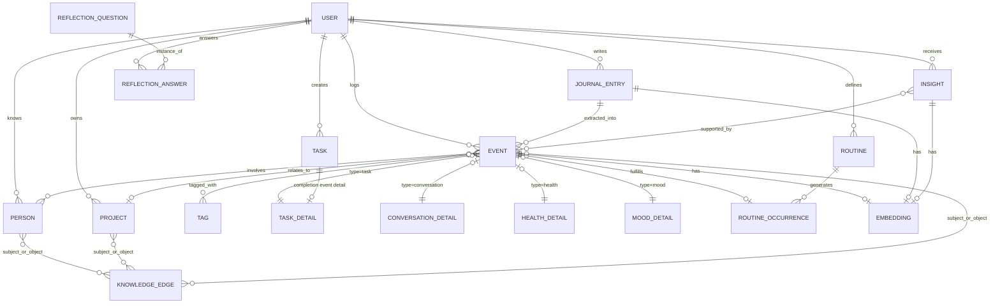

# Chronos — Core Domain Data Model (ERD)

Status: **Draft v1** — logical model, ready to translate into Django models / DDL in PR-0002+.
Owner decisions below are frozen unless revisited via an ADR (`docs/adr/`).

## 1. Design Principles

These follow directly from the product vision:

1. **Event is the universal unit.** Tasks finished, conversations, workouts, moods, meals,
   meetings — everything that happens becomes an `Event` row. This is what lets the
   reasoning layer treat "life" as one queryable timeline instead of five disconnected apps.
2. **Structured facts + free narrative are both first-class.** A `JournalEntry` (raw text or
   transcribed voice) is never discarded after parsing — it stays as the source of truth,
   and the `Events` extracted from it link back to it.
3. **The knowledge graph lives in PostgreSQL, not a separate graph database.** A generic,
   polymorphic edge table (`KnowledgeEdge`) captures relationships between any two entities
   (Person, Project, Event, Tag...). Neo4j is deferred until/unless query patterns actually
   demand native graph traversal (per the frozen stack decision).
4. **Class-table inheritance for Events, not one giant sparse table.** A slim `Event` base
   row carries what's true for every event (who, when, what kind, how it felt, how
   important). Type-specific detail lives in a satellite table (`TaskDetail`,
   `ConversationDetail`, `HealthDetail`, ...) joined 1:1 on `event_id`. This keeps the base
   table fast to scan for the planner/timeline while keeping each detail table properly
   typed instead of a JSONB grab-bag.
5. **Routines are definitions; occurrences are facts.** A `Routine` ("workout every
   weekday morning") is a template. Each day produces a `RoutineOccurrence` recording
   expected vs. actual — this is what powers "you always postpone exercise after difficult
   meetings."
6. **Embeddings are addressed generically.** One `Embedding` table keyed by
   `(content_type, content_id)` covers Events, JournalEntries, and Insights alike, so
   semantic search doesn't need a vector column bolted onto every table.

## 2. Logical ERD

## 3. Entity Definitions

### `User`
The account. One user = one life being modeled (no multi-tenant household sharing in v1).
| Field | Type | Notes |
|---|---|---|
| id | UUID PK | |
| email | citext, unique | |
| timezone | text | IANA tz name, e.g. `Europe/Berlin` — critical for the planner |
| wake_time_default | time | seed for the Planner Agent |
| sleep_time_default | time | |
| created_at | timestamptz | |

### `Person`
Someone in the user's life (not a system account). Extracted automatically from journal
text on first mention; merged/deduplicated via an Entity Resolution step.
| Field | Type | Notes |
|---|---|---|
| id | UUID PK | |
| user_id | FK → User | |
| display_name | text | |
| relationship_label | text nullable | "colleague", "mother", free text |
| aliases | text[] | for entity resolution ("Ali", "Ali R.") |
| created_at | timestamptz | |

### `Project`
| Field | Type | Notes |
|---|---|---|
| id | UUID PK | |
| user_id | FK → User | |
| name | text | |
| status | enum(`active`,`paused`,`done`,`archived`) | |
| created_at | timestamptz | |

### `Tag`
| Field | Type | Notes |
|---|---|---|
| id | UUID PK | |
| user_id | FK → User | |
| name | text, unique per user | |

### `JournalEntry`
The raw daily narrative — text typed or voice transcribed. Never mutated after extraction;
re-processing creates new Events, it doesn't rewrite this row.
| Field | Type | Notes |
|---|---|---|
| id | UUID PK | |
| user_id | FK → User | |
| entry_date | date | the day being described |
| raw_text | text | transcript or typed text |
| source | enum(`voice`,`text`) | |
| processed_at | timestamptz nullable | null until extraction pipeline has run |
| created_at | timestamptz | |

### `Event` (base table)
| Field | Type | Notes |
|---|---|---|
| id | UUID PK | |
| user_id | FK → User | |
| type | enum | `task`, `conversation`, `workout`, `meal`, `mood`, `meeting`, `idea`, `habit_check`, `learning`, `expense`, `trip`, `health` |
| occurred_at | timestamptz | when it happened (not when logged) |
| title | text | short human-readable label |
| summary | text nullable | one-line summary, LLM-generated or user-given |
| importance | smallint | 1–5 |
| mood_valence | smallint nullable | -2..+2, quick sentiment if applicable |
| source_journal_entry_id | FK → JournalEntry, nullable | null if logged directly (not via narrative) |
| project_id | FK → Project, nullable | |
| routine_occurrence_id | FK → RoutineOccurrence, nullable | set when this event fulfills a routine |
| created_at | timestamptz | |

Indexes: `(user_id, occurred_at)` for timeline scans; `(user_id, type, occurred_at)` for the
Habit/Behavior Engine's per-type queries.

### Detail tables (1:1 with `Event`, keyed on `event_id`)
Each holds fields meaningful only to that event type. Examples:

**`TaskDetail`**: `status enum(planned,in_progress,done,skipped)`, `due_at`, `estimated_minutes`

**`ConversationDetail`**: `emotion text`, `topic text`, `outcome text` (agreement / disagreement /
unresolved), `relationship_delta smallint` (-2..+2)

**`HealthDetail`**: `metric enum(sleep,exercise,weight,...)`, `value numeric`, `unit text`

**`MoodDetail`**: `label text`, `intensity smallint`, `trigger text nullable`

(`LearningDetail`, `ExpenseDetail`, `TripDetail` follow the same pattern — added as their
features are implemented, not all upfront.)

### `EventPerson` (junction)
| Field | Type |
|---|---|
| event_id | FK → Event |
| person_id | FK → Person |
| role | text nullable (e.g. "counterpart", "mentioned") |

### `EventTag` (junction)
| Field | Type |
|---|---|
| event_id | FK → Event |
| tag_id | FK → Tag |

### `Task`
The mutable, plannable unit — distinct from the immutable `Event` log. Completing a task
writes a `task`-type `Event` (with `TaskDetail.status = done`) for the historical record;
the `Task` row itself keeps evolving until archived.
| Field | Type | Notes |
|---|---|---|
| id | UUID PK | |
| user_id | FK → User | |
| project_id | FK → Project, nullable | |
| title | text | |
| status | enum(planned,in_progress,done,skipped,cancelled) | |
| priority | smallint | |
| due_at | timestamptz nullable | |
| estimated_minutes | int nullable | |
| scheduled_event_id | FK → Event, nullable | the time-boxed slot the Planner Agent assigned |
| created_at | timestamptz | |

### `Routine`
| Field | Type | Notes |
|---|---|---|
| id | UUID PK | |
| user_id | FK → User | |
| name | text | e.g. "Morning workout" |
| category | text | |
| schedule_rule | text | RRULE string (iCal recurrence) |
| expected_duration_minutes | int | |
| active | boolean | |

### `RoutineOccurrence`
One expected instance of a routine on a given date — the row the Behavior Engine reasons over.
| Field | Type | Notes |
|---|---|---|
| id | UUID PK | |
| routine_id | FK → Routine | |
| expected_date | date | |
| status | enum(pending,fulfilled,skipped) | |
| skip_reason | text nullable | inferred from journal or asked directly |
| fulfilling_event_id | FK → Event, nullable | set when `status = fulfilled` |

### `KnowledgeEdge` (the in-Postgres knowledge graph)
| Field | Type | Notes |
|---|---|---|
| id | UUID PK | |
| user_id | FK → User | |
| subject_type | enum(person,project,event,tag) | polymorphic |
| subject_id | UUID | |
| predicate | text | e.g. `works_on`, `met`, `improves_after`, `failed_routine` |
| object_type | enum(person,project,event,tag) | |
| object_id | UUID | |
| confidence | numeric(3,2) | 0–1, LLM-assigned |
| valid_from | timestamptz nullable | for relationships that can change over time |
| valid_to | timestamptz nullable | |
| created_at | timestamptz | |

No FK constraints on `subject_id`/`object_id` (they're polymorphic) — integrity is enforced
at the application layer. This is the one deliberate denormalization in the schema.

### `Embedding`
| Field | Type | Notes |
|---|---|---|
| id | UUID PK | |
| content_type | enum(event,journal_entry,insight) | |
| content_id | UUID | |
| model_name | text | e.g. `text-embedding-3-large` |
| vector | vector(1536) | pgvector column |
| created_at | timestamptz | |

Unique on `(content_type, content_id, model_name)` so re-embedding with a new model doesn't
clobber old vectors.

### `Insight`
Patterns the reasoning layer has derived ("meetings with Ali are more productive after
lunch"). Distinct from `KnowledgeEdge`: an edge is one relational fact, an `Insight` is a
narrated conclusion that cites the events supporting it.
| Field | Type | Notes |
|---|---|---|
| id | UUID PK | |
| user_id | FK → User | |
| statement | text | |
| category | enum(productivity,health,relationship,habit,learning) | |
| confidence | numeric(3,2) | |
| status | enum(active,dismissed,confirmed) | user can give feedback |
| created_at | timestamptz | |

### `InsightEvent` (junction — evidence)
| Field | Type |
|---|---|
| insight_id | FK → Insight |
| event_id | FK → Event |

### `ReflectionQuestion` / `ReflectionAnswer`
Adaptive evening questions ("You seemed frustrated after talking with Sara — did that get
resolved?") rather than a static "how was your day."
| `ReflectionQuestion` | Type |
|---|---|
| id | UUID PK |
| user_id | FK → User |
| prompt_template | text |
| generated_from_event_id | FK → Event, nullable |
| asked_at | timestamptz |

| `ReflectionAnswer` | Type |
|---|---|
| id | UUID PK |
| question_id | FK → ReflectionQuestion |
| answer_text | text |
| resulting_event_id | FK → Event, nullable |

## 4. Deliberately Deferred

- **Event sourcing / append-only ledger.** The model above is CRUD-style with an
  Event *table*, not full event-sourcing with replayable command logs. Revisit only if
  audit/undo requirements demand it — don't build it speculatively.
- **Multi-user / household sharing.** Schema assumes one user per life graph.
- **Soft-delete strategy.** Add `deleted_at` columns when the first real deletion
  requirement shows up, not before.

## 5. Next Steps

1. Translate this into Django models (`apps/backend`) as part of the backend bootstrap PR.
2. Write the first Alembic-equivalent (Django) migration — this file stays the source of
   truth for schema review; the migration is generated from it, not the other way around.
3. Add indexes only where a real query pattern justifies them beyond the two listed above —
   avoid speculative indexing.
